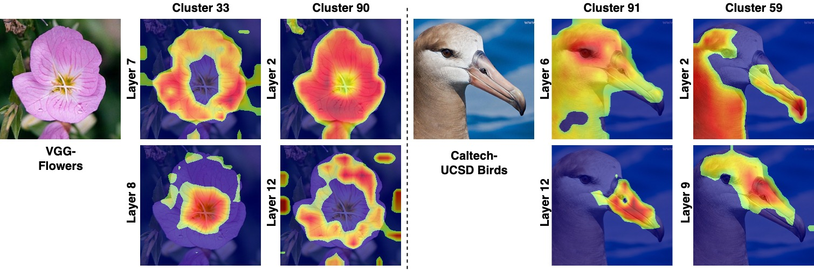

# GIFT
> [GIFT: Generative Interpretable Fine-Tuning Transformers](https://arxiv.org/abs/2312.00700)<br>
> [Chinmay Savadikar](https://savadikarc.github.io)<sup>1</sup>, Xi Song<sup>2</sup>, [Tianfu Wu](https://ece.ncsu.edu/people/twu19/)<sup>1</sup><br>
> <sup>1</sup>North Carolina State University, <sup>2</sup>An Independent Researcher

<p align="center">

</p>

Code coming soon!

## Citation
```bibtex
@misc{savadikar2024gift,
    title={GIFT: Generative Interpretable Fine-Tuning}, 
    author={Chinmay Savadikar and Xi Song and Tianfu Wu},
    year={2024},
    eprint={2312.00700},
    archivePrefix={arXiv},
    primaryClass={cs.CV}
}
```