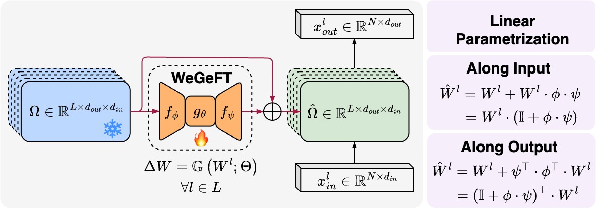
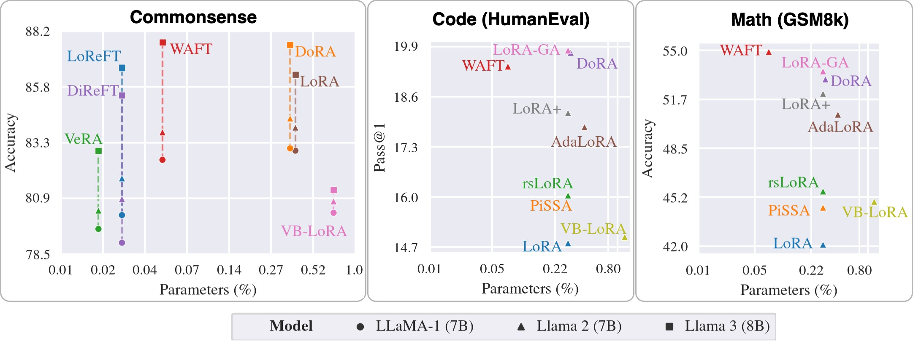
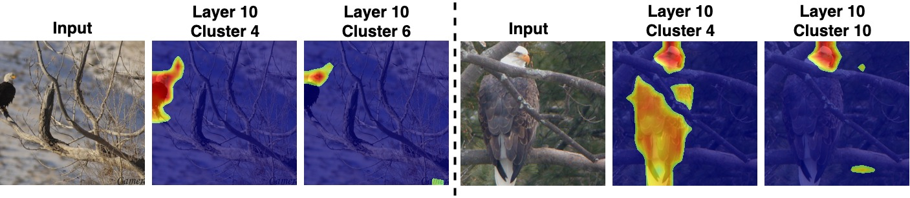

# WeGeFT: Weight‑Generative Fine‑Tuning for Multi‑Faceted Efficient Adaptation of Large Models
[Chinmay Savadikar](https://savadikarc.github.io)<sup>1</sup>, Xi Song<sup>2</sup>, [Tianfu Wu](https://ece.ncsu.edu/people/twu19/)<sup>1</sup><br>
<sup>1</sup>North Carolina State University, <sup>2</sup>An Independent Researcher<br>
ICML 2025<br>
[[**Openreview**](https://openreview.net/forum?id=K0sv5T2usb)] | [[**ArXiv**](https://arxiv.org/abs/2312.00700)] | [[**Website**](https://savadikarc.github.io/wegeft)]

## Method Overview
<p align="center">

</p>

## Performance
<p align="center">

</p>

## Visual Interpretability
<p align="center">

</p>

## PEFT integration
We provide a custom **peft** package with WeGeFT integration, forked from `peft==0.12.0`

## Language Modeling
The language modeling experiments use the custom peft package. Please refer to [`language_modeling/README.md`](language_modeling/README.md) for instructions about envionment setup, installation and scripts.

## Visual Recognition
The visual recognition experiments use a custom WeGeFT code, provded in [`visual_recognition`](visual_recognition). Please refer to [`visual_recognition/README.md`](visual_recognition/README.md) for instructions about envionment setup, installation and scripts.

## Acknowledgements
This code is based on code from [timm](https://github.com/huggingface/pytorch-image-models/tree/main), [TOAST](https://github.com/bfshi/TOAST), [pyreft](https://github.com/stanfordnlp/pyreft), [LoRA-GA](https://github.com/Outsider565/LoRA-GA). We thank the authors for their amazing work.

## Citation
```bibtex
@inproceedings{
    savadikar2025wegeft,
    title={WeGe{FT}: Weight\nobreakdash-Generative Fine\nobreakdash-Tuning for Multi\nobreakdash-Faceted Efficient Adaptation of Large Models},
    author={Chinmay Savadikar and Xi Song and Tianfu Wu},
    booktitle={Forty-second International Conference on Machine Learning},
    year={2025},
    url={https://openreview.net/forum?id=K0sv5T2usb}
}
```
